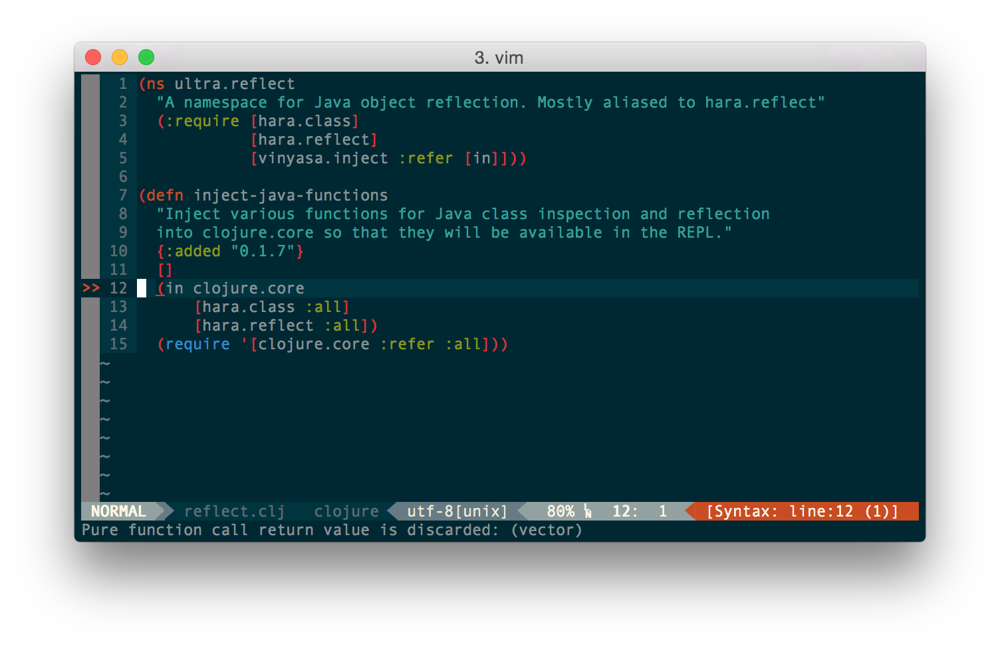

# vim-eastwood


vim-eastwood is a vim plugin for [Eastwood](https://github.com/jonase/eastwood/), the Clojure lint tool. Rather than shelling out to Leiningen, it uses a [vim-fireplace](https://github.com/tpope/vim-fireplace/) REPL connection to only lint the current file. This has the advantage of sidestepping Leiningen's startup time and keeping Vim from hanging, though the very first time you use it with a given REPL server there will be a slight delay as it loads the `eastwood.lint` namespace.

You should be aware of the side effects of [using Eastwood from a REPL](https://github.com/jonase/eastwood#running-eastwood-in-a-repl).

It extends [Syntastic](https://github.com/scrooloose/syntastic)'s checkers, so you'll see those familiar markers in your UI:



## Installation

### Requirements

You'll want to have [Eastwood](https://github.com/jonase/eastwood/), [vim-fireplace](https://github.com/tpope/vim-fireplace/) and [Syntastic](https://github.com/scrooloose/syntastic) installed, and you'll need to make sure Eastwood is somewhere on your project's classpath. I'd recommend adding the following to your `~/.lein/profiles.clj`:

```clojure
:dependencies [[jonase/eastwood "0.2.1" :exclusions [org.clojure/clojure]]]
```

You'll also need to enable this plugin as the Clojure syntax checker for Syntastic by adding the following line to your ~/.vimrc:

```vim
let g:syntastic_clojure_checkers = ['eastwood']
```

In order for Syntastic to actually lint the file you're working on, you'll also need to have a REPL connection open through fireplace.

After that, the rest should take care of itself.

### Installing with Pathogen

Assuming you already have [Pathogen](https://github.com/tpope/vim-pathogen) installed, you should be good to go with the following:

```
cd ~/.vim/bundle && \
git clone https://github.com/venantius/vim-eastwood.git
```

### Installing with Vundle

To install vim-eastwood with [Vundle](https://github.com/gmarik/Vundle.vim), add the following line to your `.vimrc`:
```
Bundle 'venantius/vim-eastwood'
```

## Other Vim + Clojure Plugins

If you like this, you should check out [vim-cljfmt](https://github.com/venantius/vim-cljfmt)!

## License

Copyright (c) 2019 W. David Jarvis.

Licensed under the Eclipse Public License, the same as Clojure.
